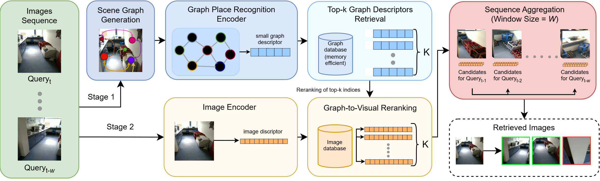

# GraphSeqLoc

**GraphSeqLoc** — research codebase for **graph-enhanced visual place recognition** and sequence-aware localization.

The pipeline combines image descriptors (MegaLoc, FoL, SelaVPR++, EDTFormer, …) with scene-graph embeddings (GAT graph encoder) to retrieve places from a database, optionally rerank candidates, fuse per-frame results over a query sequence, and report Recall@k under room / pose similarity criteria.

Supported datasets include **3RScan** and **ScanNet**.

---

## Pipeline overview



High-level stages implemented in code:

1. **Descriptors** — `gsloc.models` / `mmpr.models` encode images and/or scene graphs.
2. **Indexing & retrieval** — FAISS flat L2 index (`mmpr.inference`), built once and reused from cache.
3. **Reranking** — optional second-pass ranking with another (or the same) model.
4. **Sequence PR** — candidate-pool fusion over a temporal window (`seq_lengths`).
5. **Evaluation** — room-level or pose-based positives (`room-sim`, `pose-far-sim` / 3 m, `pose-near-sim` / 2 m).

Core entry point: `gsloc.inference.test.Test` + `TestConfig` (used by the main notebook).

---

## Model weights

Pretrained / experiment checkpoints:

| Asset | Location / link |
| --- | --- |
| Image baselines shipped in-repo | `weights/` (`FoL_base.pth`, `SelaVPRplusplus_base_rerank.pth`, `EDTformer.pth`) |
| GraphSeqLoc (GAT + MegaLoc fusion) | **TODO: add download link** |
| Edge feature normalizer | **TODO: add download link** |

After download, point notebook paths (or place files under `weights/`) accordingly. MegaLoc weights are loaded via `torch.hub` when using `mmpr.models.MegaLoc`.

---

## Installation

Quick local setup with [`uv`](https://github.com/astral-sh/uv):

```bash
git clone <REPO_URL> GraphSeqLoc
cd GraphSeqLoc
git submodule update --init --recursive
uv sync --group torch --group notebook --group viz --group faiss-cpu
source .venv/bin/activate
```

For OpenPlaceRecognition / Docker workflows, see **[INSTALL.md](INSTALL.md)** and **[docs/installation_guide.md](docs/installation_guide.md)**.

Python ≥ 3.10. GPU + CUDA is recommended for the full experiments.

---

## Quick start (main experiment)

The primary end-to-end example is:

**[`notebooks/main_exp.ipynb`](notebooks/main_exp.ipynb)**  
(same notebook as [`notebooks/13_MAIN_EXP.ipynb`](notebooks/13_MAIN_EXP.ipynb))

Typical flow inside the notebook:

1. Import packages and fix RNG seeds.
2. Define similarity / sequence-filter configs and image transforms.
3. Load models (GraphSeqLoc checkpoint + image baselines).
4. Use `run_test(...)` to build `TestConfig`, run retrieval (+ optional rerank), and write sequence Recall reports under `data/tests/`.
5. Configure dataset paths, graph source (`GT` / `Makarov` / `Fross` / …), and hyperparameters per experiment block, then run the corresponding loop.

Before running, update:

- `dataset_path` — root of 3RScan / ScanNet / SberRobotics
- `weights_path` / graph checkpoint and `edge_normalizer_path`
- `scene_list_path`, `query_list_path`, `scans_dir`, `graph_dir`

Example launch:

```bash
uv run jupyter notebook notebooks/main_exp.ipynb
```

Plotting helpers live under `scripts/` (e.g. `plot_3rscan_recall_vs_window_panels.py`) and `gsloc.utils.visual`.

---

## Repository layout

```text
GraphSeqLoc/
├── src/gsloc/          # Datasets, graph models, Test harness, fusion utils
├── src/mmpr/           # Place-recognition pipelines, FAISS index, sequence PR
├── notebooks/          # Experiments (main_exp.ipynb = primary example)
├── scripts/            # Evaluation / visualization scripts
├── weights/            # Local baseline checkpoints
├── data/               # Cached indexes, reports, plots (mostly local)
├── libs/               # OpenPlaceRecognition submodule
├── docker/             # Devel image helpers
├── docs/               # Extra install & tooling notes
└── INSTALL.md          # Detailed install (uv + Docker)
```

---

## Citation

If you use this code in academic work, please cite the corresponding paper (link / BibTeX **TODO**).

```bibtex
@inproceedings{TODO_graphseqloc,
  title     = {TODO},
  author    = {TODO},
  booktitle = {TODO},
  year      = {TODO}
}
```

---

## License

See repository license file when published. Third-party code (e.g. [OpenPlaceRecognition](https://github.com/OPR-Project/OpenPlaceRecognition), MegaLoc, FoL, SelaVPR++, EDTFormer) remains under their respective licenses.
